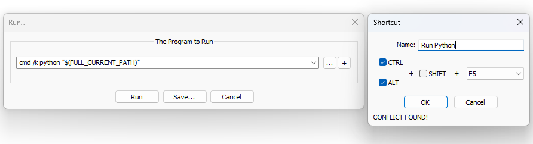
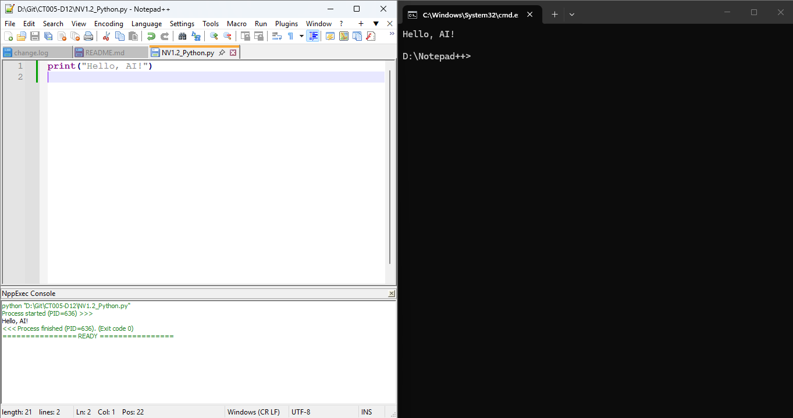

# BÁO CÁO NHIỆM VỤ 1.2: CẤU HÌNH PHẦN MỀM CƠ BẢN

## 1. Quy trình thực hiện

1. **Tham vấn AI:** Sử dụng công cụ AI (Gemini) để tra cứu quy trình cài đặt và cấu hình Notepad++ trên Windows.
2. **Cài đặt phần mềm:**
   - Tải và cài đặt Notepad++ từ trang chủ.
   - Kiểm tra môi trường Python trên hệ thống thông qua Command Prompt.
3. **Cấu hình chạy Python:**
 - Mở Notepad++, chọn **Run** -> **Run...** (hoặc nhấn **F5**).
   - Nhập lệnh: `cmd /k python "$(FULL_CURRENT_PATH)"`
   - Nhấn **Save...**, đặt tên lệnh là `Run Python` và thiết lập tổ hợp phím tắt **`Ctrl + Alt + F5`**.
4. **Kiểm tra và lưu trữ:**
   - Viết chương trình hiển thị chuỗi `Hello, AI!`.
   - Thực thi code bằng phím tắt **`Ctrl + Alt + F5`** (hoặc qua plugin NppExec) và chụp ảnh màn hình kết quả.- Chạy kiểm tra kết quả và chụp ảnh màn hình.

---

## 2. Kết quả đạt được

### Cấu hình phím tắt chạy Python:


### Kết quả chạy Python:


### File mã nguồn Python:
Mã nguồn được lưu tại file `NV1.2_Python.py`.

```python
print("Hello, AI!")

---
```
## 3. Nguồn dẫn
* Toàn bộ quy trình cài đặt và cấu hình được thực hiện dưới sự hỗ trợ và tham tham khảo từ công cụ AI (Gemini).
