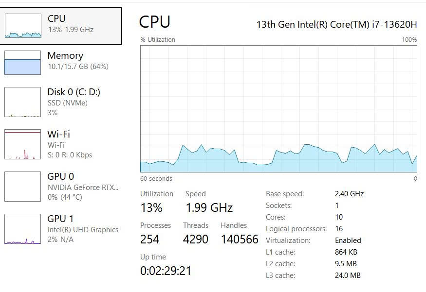
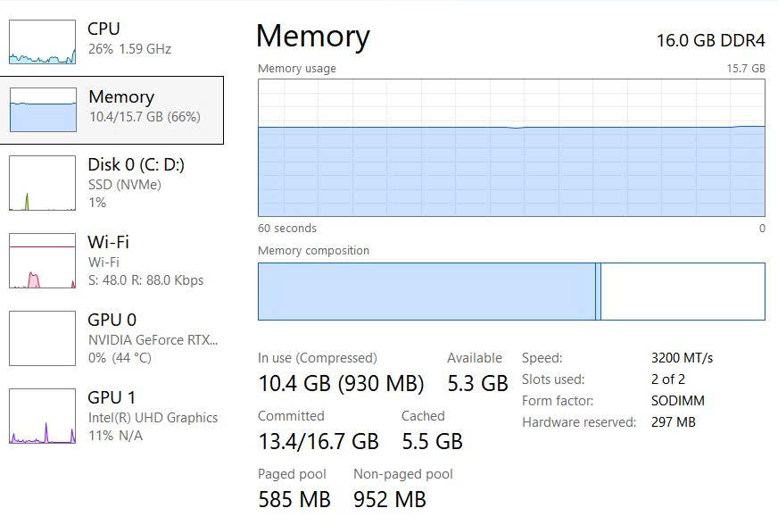
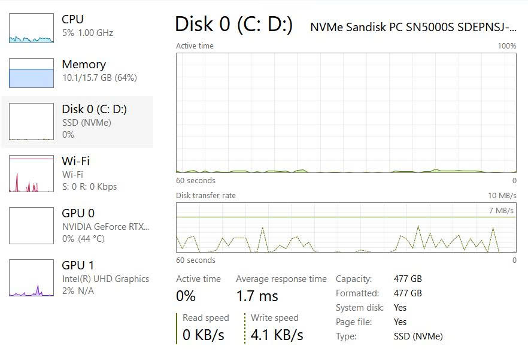

BÁO CÁO NHIỆM VỤ 1.1: CẤU HÌNH PHẦN CỨNG

I. THÔNG TIN CHUNG
- Nhóm thực hiện: Nhóm 1
- Tên thành viên: Bùi Trương Bảo Ngọc, Nguyễn Thái Anh, Lê Phạm Gia Bảo, Trần Ngọc Thiên Bảo
- Lớp / Học phần: CT005_D12 / NỀN TẢNG CÔNG NGHỆ SỐ
- Nhiệm vụ: Tìm hiểu cấu hình phần cứng

II. QUY TRÌNH THỰC HIỆN
- Bước 1: Tham vấn AI (ChatGPT).
- Bước 2: Dựa trên câu trả lời AI, sử dụng công cụ hệ thống (Task Manager trên Windows hoặc System Information) để kiểm tra thông số phần cứng của máy tính.
- Bước 3: Chụp màn hình hệ thống Task Manager.
- Bước 4: Viết kết quả thu hoạch được.

III. KẾT QUẢ ĐẠT ĐƯỢC - CẤU HÌNH PHẦN CỨNG

1. CPU (Central Processing Unit - Bộ xử lý trung tâm)
- Khái niệm: CPU là bộ phận thực hiện các phép tính và xử lý lệnh của máy tính (được xem là “bộ não” của máy tính).
- Một số thông số CPU thường gặp:
  + Model / Tên CPU: Ví dụ Intel Core i5-12400 hoặc AMD Ryzen 5 5600.
  + Tốc độ xung nhịp: Đơn vị GHz, cho biết tốc độ hoạt động của CPU.
  + Số nhân (Cores): Số đơn vị xử lý vật lý trong CPU.
  + Số luồng (Logical Processors / Threads): Số luồng mà hệ điều hành có thể sử dụng để xử lý công việc.
  + CPU Usage: Phần trăm mức độ CPU đang được sử dụng tại thời điểm kiểm tra.

2. RAM (Random Access Memory - Bộ nhớ truy cập ngẫu nhiên)
- Khái niệm: RAM là bộ nhớ tạm thời được máy tính sử dụng để lưu dữ liệu và chương trình đang hoạt động. RAM càng phù hợp với nhu cầu sử dụng thì máy càng có khả năng chạy nhiều chương trình cùng lúc.
- Một số thông số RAM thường gặp:
  + Dung lượng: Ví dụ 4 GB, 8 GB, 16 GB, 32 GB.
  + Speed: Tốc độ RAM, thường tính bằng MHz (hoặc MT/s).
  + In use: Dung lượng RAM đang được sử dụng.
  + Available: Dung lượng RAM còn khả dụng.
- Lưu ý: RAM là bộ nhớ tạm thời, dữ liệu trong RAM sẽ mất đi khi tắt nguồn máy tính.

3. Ổ cứng (Storage Device)
- Khái niệm: Ổ cứng là thiết bị dùng để lưu trữ lâu dài hệ điều hành, phần mềm, tài liệu, hình ảnh, video và các dữ liệu khác.
- Phân loại phổ biến:
  + HDD (Hard Disk Drive):
    * Sử dụng các đĩa từ quay để lưu trữ dữ liệu.
    * Giá thành thường thấp hơn, dung lượng lớn.
    * Tốc độ đọc/ghi thấp hơn SSD.
    * Có bộ phận cơ học nên dễ bị ảnh hưởng bởi va đập.
  + SSD (Solid State Drive):
    * Sử dụng bộ nhớ flash và không có đĩa quay cơ học.
    * Tốc độ đọc/ghi dữ liệu nhanh.
    * Khởi động Windows và mở phần mềm nhanh chóng.
    * Hoạt động bền bỉ, không có bộ phận chuyển động cơ học.
    * Giá trên mỗi GB thường cao hơn HDD.

IV. NGUỒN TRÍCH DẪN
- Toàn bộ thông tin khái niệm về phần cứng được tham vấn và trích dẫn từ AI (ChatGPT).
